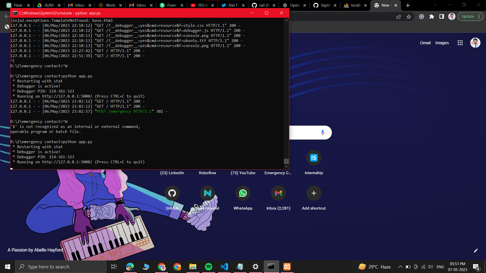
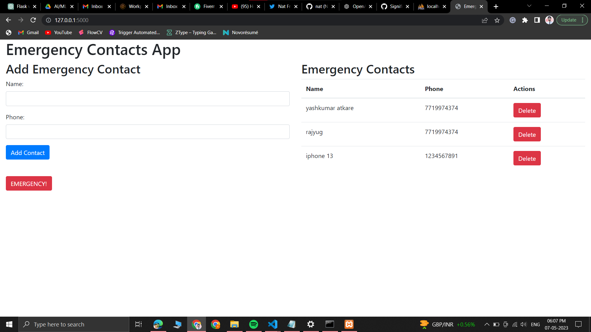
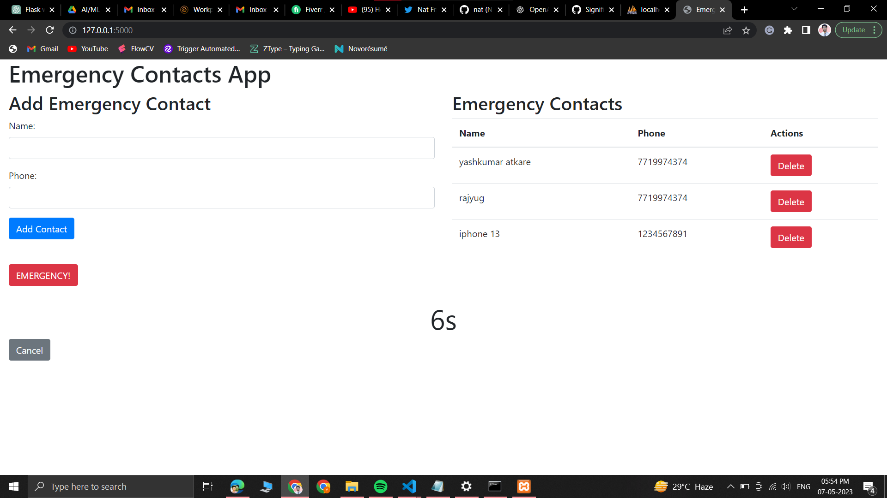
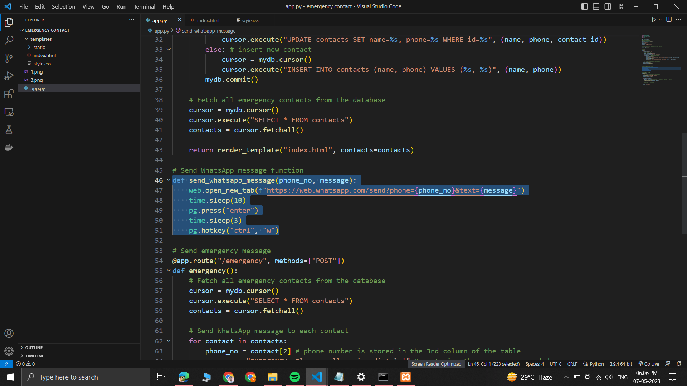

# Emergency-Contact-App
This is a web application built with Flask that allows users to save emergency contacts and send out a message to those contacts in the event of an emergency. The app is designed to be simple and easy to use, particularly for older adults aged 65 and over.

## About

As people age, they often become more vulnerable to emergencies, such as falls, medical issues, or accidents. In these situations, it's important to have a reliable way to quickly contact emergency services or loved ones who can provide assistance.

The Emergency Contact App is designed to help older adults prepare for emergencies by providing a simple and accessible tool for storing and accessing emergency contacts. With just a few clicks, users can save their contacts' names and phone numbers, and then easily send out a pre-written message in the event of an emergency.

## Features

The Emergency Contact App includes the following features:

* Home screen: The home screen displays three emergency contacts that users can customize, as well as a button to add or change those contacts.
* Emergency button: When users click the red "Emergency!" button, a 10-second timer begins counting down. If the user does not cancel the timer, a pre-written message * will be sent to all saved contacts via WhatsApp.
* Cancel button: Users can cancel the emergency message by clicking the "Cancel" button before the timer reaches zero.
* Contact list: Users can view and edit their saved emergency contacts on the Contact List screen.

In the future, we plan to add additional features, such as a calling system and a Google Maps location link in the emergency message.

## How to Use
To use the Emergency Contact App, follow these steps:

1. Install Flask and the necessary dependencies by running pip install -r requirements.txt.
2. Run the app by running python app.py.
3. Open your web browser and navigate to http://localhost:5000/.
4. Add or edit your emergency contacts on the home screen.
5. When you need to send an emergency message, click the red "Emergency!" button and wait for the timer to count down. If you change your mind, click the "Cancel" 6. 6. button to stop the message from being sent.
7. To view or edit your emergency contacts, navigate to the Contact List screen.

## Technologies Use
The Emergency Contact App is built using the following technologies:

* Flask: A Python web framework used for creating the app.
* Bootstrap: A front-end framework used for styling and layout.
* MySQL: A database used for storing emergency contact information.
* SweetAlert2: A JavaScript library used for displaying alerts and confirmation messages.
* jQuery: A JavaScript library used for handling user interactions and sending AJAX requests.

## Screenshots
Here are some screenshots of the Emergency Contact App:

Project starting on cmd

Starting the app on command prompt

Home screen

Home screen displaying emergency contacts and options to add or change contacts

Timer screen

Timer screen displayed after clicking the "Emergency!" button

Code for sending WhatsApp message

Code for sending a pre-written WhatsApp message to all saved emergency contacts

##Contributors

This project was created by *Yashkumar Atkare*. If you have any questions or suggestions for improvement, please contact me at yashatkare9@gmail.com. Thank you for using the Emergency Contact App!
